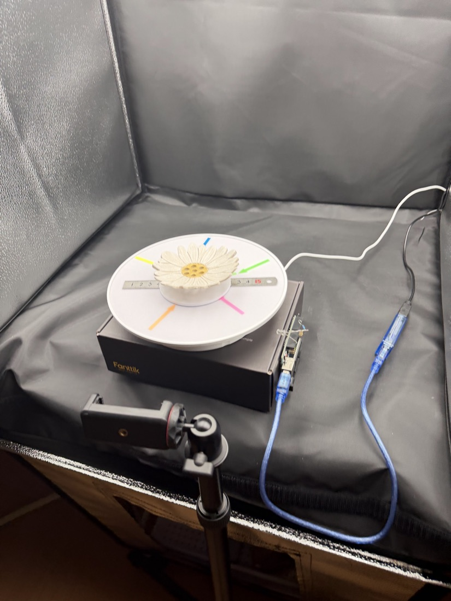
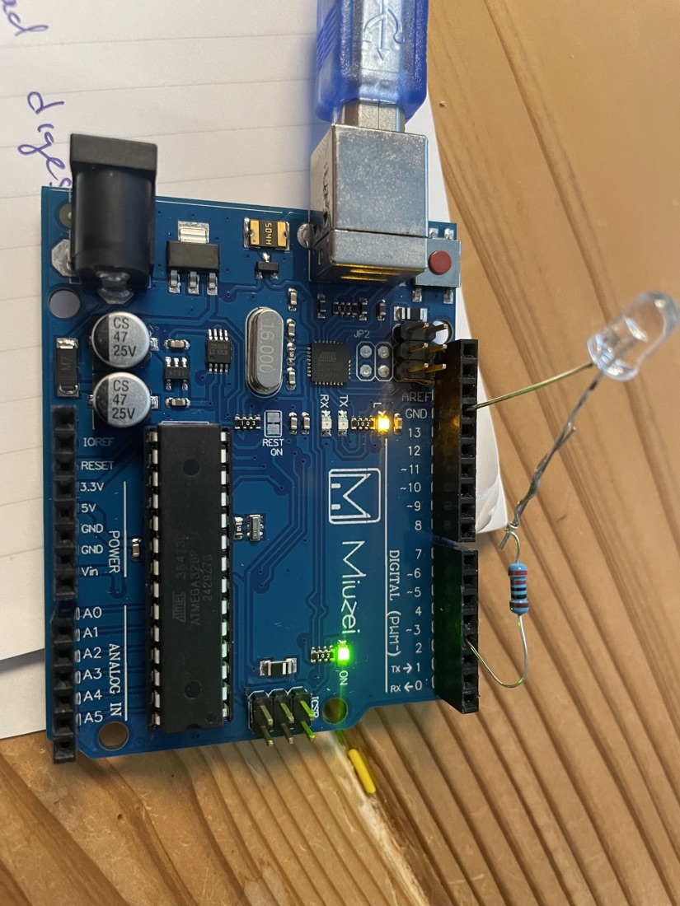
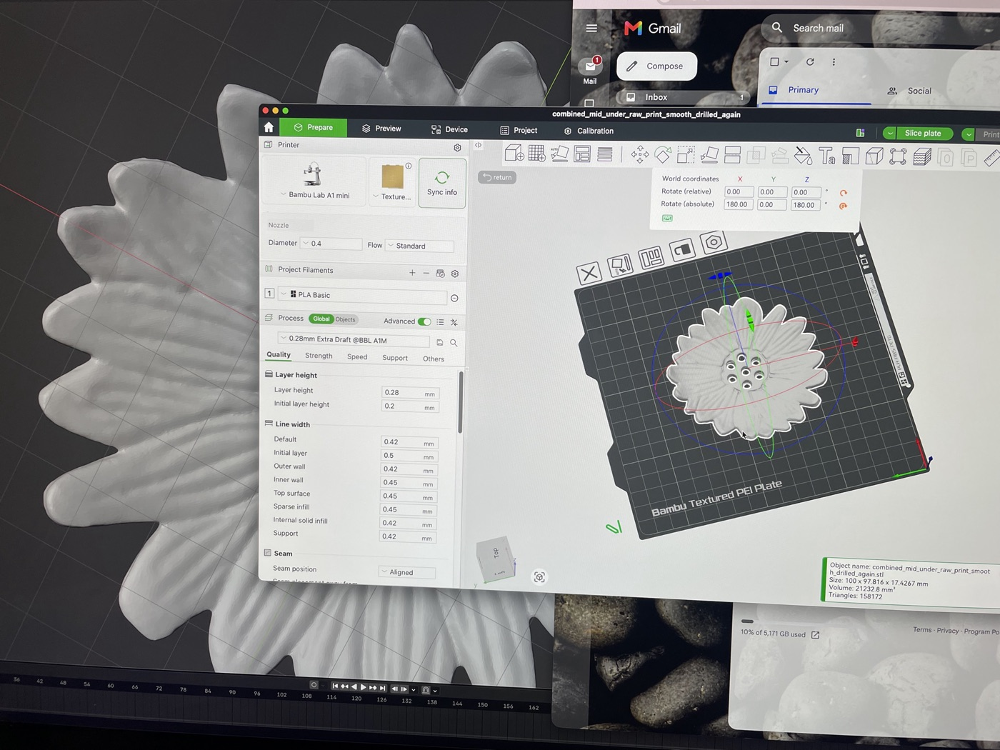
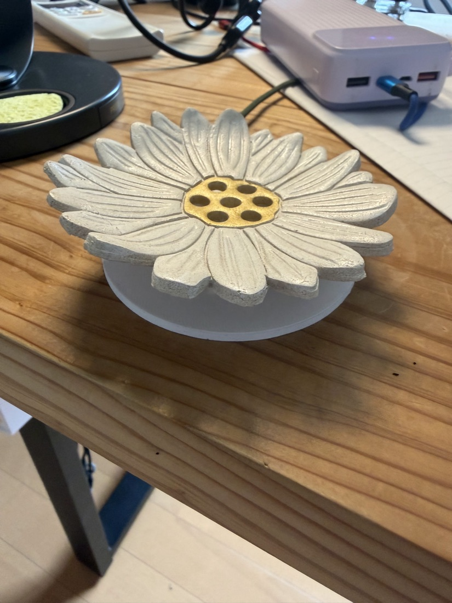
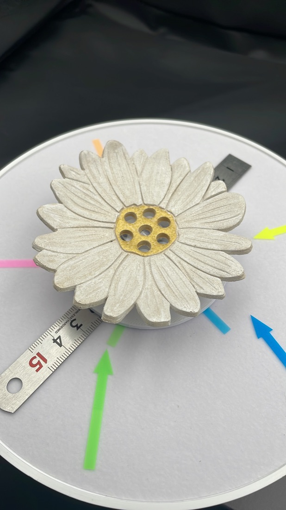

# 3D Scanner — Turntable Photogrammetry Rig

A DIY tabletop 3D scanner that turns a physical object into a printable, watertight
STL. An iPhone runs a from-scratch HTTP camera server; a Mac orchestrates the scan;
an Arduino drives the turntable by impersonating its infrared remote; Apple Object
Capture reconstructs the mesh; a PyMeshLab pass prepares it for printing and casting.

<p align="center">
  
  <br>
  <em>The complete rig. The light tent does two jobs — flat diffuse light, and a
  <strong>plain matte backdrop</strong>. A feature-rich static background is the single
  most reliable way to break a turntable scan: the object rotates, the background does
  not, and the solver cannot reconcile two rigid scenes moving relative to each other.
  The phone at left is running ScannerCam with focus, exposure and white balance all
  reading <code>LOCKED</code>; the Arduino beside the turntable fires the infrared
  toggle that steps it.</em>
</p>

Built 2026. Author: Arie Meir. Personal project — see [NOTICE.md](NOTICE.md).

**→ [Read the engineering log](docs/engineering-log.md)**
· [Read the ScannerCam technical spec](docs/scannercam_spec.md)
· [Browse the source on GitHub](https://github.com/ariemeir/technical-portfolio/tree/main/3dscanner)

> **Reference only.** A working single-operator rig at late-prototype maturity,
> published so the engineering can be read. Deployment specifics (device IDs,
> network addresses, signing team) have been replaced with placeholders.

---

## The problem

Photogrammetry — reconstructing 3D geometry from overlapping photographs — needs
dozens of images of an object from evenly spaced angles, shot under *identical*
optical conditions. Commercial turntable scanners exist and cost accordingly. The
parts to build one do not: a motorized photography turntable is inexpensive, and a
modern phone has a better sensor than most dedicated scanner cameras.

The gap is control. The turntable obeys an infrared remote and has no data port.
The phone's camera app will happily refocus and re-meter between shots, which
destroys the reconstruction. Nothing talks to anything else.

This project closes that gap end-to-end: object in, printable mesh out, with every
frame verified byte-for-byte along the way.

## How it works

```
   ┌──────────────┐                            ┌────────────────────────────┐
   │ IR remote    │  reverse-engineered        │  iPhone — "saru"           │
   │ 14 NEC codes │  → turntable_codes.json    │  ScannerCam (SwiftUI)      │
   └──────┬───────┘                            │  ┌──────────────────────┐  │
          │ replayed                           │  │ HTTP/1.1 server      │  │
          ▼                                    │  │ NWListener, 13 routes│  │
   ┌──────────────┐   serial ASCII 115200      │  │ bearer auth          │  │
   │ Arduino Uno  │◄───────────────────┐       │  └──────────┬───────────┘  │
   │ IR LED / D3  │  PING→PONG         │       │  AVCapture: focus/exposure │
   └──────┬───────┘  R <rawhex>        │       │  /WB LOCKED for the run    │
          │ 38 kHz                     │       └─────────────┬──────────────┘
          ▼                            │                     │ HTTP over
   ┌──────────────┐                    │                     │ Wi-Fi / Tailscale
   │  turntable   │            ┌───────┴─────────────────────┴───────┐
   │  (no data    │            │        Mac — "shika"                │
   │   port)      │            │  scan.py — session controller       │
   └──────────────┘            │  move → settle → capture → pull →   │
                               │  SHA-256 verify → next frame        │
                               └──────────────────┬──────────────────┘
                                                  │  scans/completed/<id>/
                                                  ▼  + tar.gz + checksums
                               ┌─────────────────────────────────────┐
                               │  Apple Object Capture (RealityKit)  │
                               │  objcap CLI → USDZ + OBJ → STL      │
                               └──────────────────┬──────────────────┘
                                                  ▼
                               ┌─────────────────────────────────────┐
                               │  repair.py (PyMeshLab)              │
                               │  weld → drop strays → close holes → │
                               │  orient → scale to mm → watertight  │
                               └─────────────────────────────────────┘
```

One scan is 36–72 frames. Each frame is: rotate by a timed IR pulse, wait for
vibration to settle, trigger the shutter over HTTP, download the JPEG, verify its
SHA-256, then move again. A 72-frame run plus reconstruction takes roughly five
minutes per loop on an M4.

<p align="center">
  
  <br>
  <em>The same rig with the lights off. Note what is <em>not</em> there: no wire runs
  between the Arduino and the turntable. The only link is a few centimetres of infrared
  across open air, one-way, unacknowledged — which is the constraint the entire
  controller design answers to.</em>
</p>

The two machines carry codenames throughout the code and docs: **`saru`** is the
iPhone, **`shika`** is the Mac.

## Driving an actuator you cannot observe

This is the interesting control problem, and it shaped the whole controller.

<p align="center">
  
  <br>
  <em>The entire electrical interface to the turntable: one infrared LED on a series
  resistor, run off the Uno's digital header. <strong>Nothing connects to the turntable
  at all</strong> — it has no data port, so the Arduino simply impersonates its remote.
  The LED emits outside the visible band, so it looks equally dead whether or not it is
  working, which is exactly why <code>ir_dc_test.ino</code> exists: hold the pin high
  for three seconds and view it through a phone camera, where the emitter shows up as a
  violet glow. (The firmware header documents a 2N2222 driver stage for more range;
  this is the simpler direct-drive bring-up wiring.)</em>
</p>

The turntable's only relevant input is the remote's **`START_PAUSE` button — a
toggle**. There is no "stop" command, no position encoder, no feedback of any kind.
Infrared is fire-and-forget: the Arduino can emit a pulse but cannot confirm the
table received it. The controller therefore cannot *know* whether the table is
spinning; it can only track what it *assumes*.

So the assumption is made explicit. The driver keeps an `AssumedState` of
`STOPPED`, `RUNNING`, or `UNKNOWN`, and **any ambiguous toggle drops it to
`UNKNOWN`** — a failed start is ambiguous, and a failed stop is worse because the
table is probably still turning. From `UNKNOWN` the controller halts the session
and demands manual realignment. It never auto-toggles its way out, because a toggle
sent against an unknown state inverts every subsequent move and silently desyncs
the entire scan.

The same logic governs interruption. On `Ctrl-C` mid-move the controller
deliberately **does not** send an emergency stop — with a toggle-only actuator, a
"stop" command has an even chance of being a "start" command — and it says so in
its output rather than leaving the operator to guess.

Angle is open-loop: `run_seconds = degrees / degrees_per_second`, minus measured
command latency and coast time. This is approximate by construction, and that is
fine — Object Capture recovers true camera pose from image features, so nominal
angles only need to be even enough to give good coverage.

## Keeping the photographs identical

Photogrammetry fails quietly when the camera changes between frames. Autofocus
shifts effective magnification; auto-exposure changes brightness; auto white
balance shifts colour and produces visible texture seams. All three are on by
default on a phone.

ScannerCam exposes hard locks for focus, exposure, and white balance, and the API
lets the controller *require* them: a capture request with `require_locks: true`
is rejected with `409 camera_not_locked` unless all three are engaged. The camera
is also pinned to a single physical lens — no virtual/dual device, so iOS cannot
silently switch lenses and change the intrinsics mid-scan.

## Integrity across three machines

A frame passes through a phone, a network, and a laptop before it is trusted. The
chain is unbroken:

1. The phone computes the JPEG's SHA-256 **in memory, before the file touches disk**.
2. That hash is returned in the capture response *and* served on download as both
   `ETag` and `X-ScannerCam-SHA256`.
3. The controller stream-hashes during download and compares against both.
4. The download lands as `frame_000034.jpg.part` and is `os.replace`d into position
   only after verification — an interrupted transfer can never masquerade as a good
   frame, and a leftover `.part` file is a hard validation failure.
5. At packaging, every frame is re-hashed from disk; the final archive gets its own
   `.sha256`.

Retries are idempotent by construction. The `request_id` for a capture is a
deterministic `uuid5(session_id, frame)`, so a retry is byte-identical and the
server returns the original capture instead of firing the shutter twice. And when
a capture fails *ambiguously*, the controller issues a `HEAD` for the remote frame
before re-firing — because the photo may actually have landed, and you do not
re-actuate physical hardware on uncertainty.

## Repository layout

| Path | Contents |
|---|---|
| [`capture/controller/`](capture/controller/) | `scan.py` + the session controller — scan loop, retry/idempotency, resumability, packaging. Python, stdlib + PyYAML + pyserial. 25 tests. |
| [`capture/iphone/`](capture/iphone/) | **ScannerCam** — the iOS camera-server app. SwiftUI + AVFoundation + Network.framework, zero third-party packages. |
| [`capture/protocols/`](capture/protocols/) | The API contract shared by both sides: `api_v1.md` and `constants.json` |
| [`firmware/turntable_ir/`](firmware/turntable_ir/) | Arduino sketches, the IR code table, and the `irctl.py` operator CLI |
| [`reconstruction/`](reconstruction/) | `objcap` Swift CLI over RealityKit, the shell pipeline, and `repair.py` print prep |
| [`docs/`](docs/) | The ScannerCam technical spec and the engineering log |
| [`config/`](config/) | `scanner.example.yaml` — the configuration template |

## The HTTP API

Local-network only, `http://<phone>:8765/api/v1`, bearer token, `snake_case` JSON.
Full reference in [`capture/protocols/api_v1.md`](capture/protocols/api_v1.md);
complete design rationale in [`docs/scannercam_spec.md`](docs/scannercam_spec.md).

| Method | Path | Purpose |
|---|---|---|
| `GET` | `/health` | Liveness. The only unauthenticated route; exposes nothing. |
| `GET` | `/status` | Camera state — lock flags, ISO, lens position, exposure duration |
| `POST` | `/captures` | Take one photo. Idempotent on `request_id`. |
| `GET` | `/projects` · `/projects/{id}` · `/manifest` | Project listing and metadata |
| `GET` | `/projects/{id}/images` | Cursor-paginated (`after_frame` / `has_more`) |
| `GET`/`HEAD` | `/projects/{id}/images/{frame}` | Download one JPEG; `HEAD` reports what `GET` would return |
| `DELETE` | image · project · all projects | Destructive routes require an `X-Confirm-Delete` echo header |
| `GET` | `/storage` | Free space, used bytes, project/image counts |

The server is hand-rolled HTTP/1.1 on `NWListener`. Scope was deliberately pinned:
**no keep-alive, no chunked encoding**, `Connection: close` on every response, always
an accurate `Content-Length`. That cut kept a from-scratch implementation tractable
and is documented rather than discovered — clients must not assume connection reuse.

## What the reconstruction stage actually runs

**COLMAP was evaluated and removed.** Its dense stereo (`patch_match_stereo`) is
CUDA-only and hard-errors on Apple Silicon, so on this hardware it could only ever
produce a sparse point cloud — no mesh. The decision reverses only if dense work is
offloaded to an NVIDIA box.

The mesh stage is **Apple Object Capture** (`RealityKit.PhotogrammetrySession`),
GPU-accelerated on M-series and purpose-built for turntable capture. `objcap` is a
~130-line Swift CLI wrapping it, tuned with `sampleOrdering = .sequential`
(consecutive turntable frames overlap, so sequential matching is both correct and
faster) and `featureSensitivity = .high`.

Detail levels, measured on 144 images at 48 MP on an M4:

| Level | Time | Triangles |
|---|---|---|
| `reduced` | 6 m 20 s | 25 k |
| `full` | 6 m 52 s | 100 k |
| `raw` | 10 m 56 s | 212 k |

The useful finding: **`reduced` is only 32 seconds faster than `full`.** Around 90%
of runtime is ingesting and solving the images, which is identical across levels;
only the final mesh/texture stage differs. So `reduced` buys a *lighter file*, not a
faster run, and `raw` is the only level that adds real geometry.

## From mesh to printable solid

A single-ring turntable scan never photographs the object's underside, so the base
is fabricated — topologically closed by the Poisson surface, but geometrically
crude. `repair.py` turns the reconstruction into something a slicer will accept:
weld vertices → drop stray components → repair non-manifold edges and vertices →
close holes (watertight) → orient the flat face's normal to +Z by PCA → scale so the
widest in-plane extent is *N* mm (STL is unitless; slicers read mm) → Taubin-smooth
only the bottom band, leaving detailed geometry untouched → seat on Z=0.

**One ordering trap, learned the hard way:** close-holes fills *every* open boundary,
including see-through holes you meant to drill. Drill on an already-watertight solid,
never before the repair pass.

<p align="center">
  
  <br>
  <em>The repaired mesh in the slicer, and the numbers are the point.
  <strong>100 × 97.816 × 17.4267 mm</strong> — <code>--diameter-mm 100</code> asked for a
  100 mm part and got one, which matters because STL carries no units and a slicer just
  reads the raw numbers as millimetres. The filename is the pipeline written out:
  <code>combined</code> mid + under rings, <code>raw</code> detail, base
  <code>smooth</code>ed, then <code>drilled</code>.</em>
</p>

<p align="center">
  
  <br>
  <em>Original and reproduction. The print carries the petal ridges and — the detail
  worth noticing — the <strong>ring of holes through the centre</strong>. Those are the
  drilled through-holes: cut as a boolean difference through an
  <em>already watertight</em> solid, because running the repair pass afterwards would
  have dutifully filled every one of them back in.</em>
</p>

## State of the code

A working rig, honestly described. What that means:

- **The iOS app has no automated tests.** All 2,824 lines were verified by manual
  `curl` sequences against the physical device. The Python controller does have a
  suite — 25 tests, no mocking library, hand-rolled fakes injected through
  constructor seams, including one that spins a real HTTP server on a random port.
- **Bonjour advertisement is not implemented.** It is declared in `Info.plist`,
  required by the spec, and `/status` even *reports* a Bonjour name — but nothing
  ever sets `NWListener.service`. This is the likely root cause of a documented
  mystery in which `saru.local` never resolved and only the Tailscale address worked.
- **`project_id` is validated on the capture route but not on the `/projects/*`
  routes**, so an authenticated request can address a single-segment `..` and reach
  the data root. Auth-gated, but a real bug.
- **No log file.** `scan_log` is in the session layout, nothing writes it, and the
  package imports no logging module — operator feedback is `print()` only.
- **Calibration is a declared hook with no data behind it.** The config supports a
  per-step turntable calibration profile; none has been measured, so rotation runs
  on a nominal 13.3 °/s figure derived from timing one revolution.
- **Several config keys are parsed and never used** — `camera.fallback_url` most
  notably, which exists precisely to solve the mDNS problem above and is never tried.
- **`reconstruction.json` hardcodes `"device": "iPhone 12"`** although the rig has
  since moved to a different phone, so every packaged scan ships a wrong field.
- **The controller lock has a TOCTOU race** — an `exists()` check followed by a
  write, where `O_CREAT|O_EXCL` was called for.
- MVP constraints, by design: the angle step must divide evenly into 360, one
  camera ring per run, `tar.gz` the only package format.

## What actually makes a scan succeed

Rig and pipeline were solid from the first run; subject and scene choice turned out
to dominate results.

| Subject / scene | Frames used | Result |
|---|---|---|
| Glossy mug, cluttered desk with a **monitor** behind | — | hard failure |
| Glossy mug, light tent, matte backdrop | 10 / 36 | partial ~90° shell |
| Matte textured ceramic flower, light tent | 36 / 36 | clean full mesh |
| Same flower at 5° steps | 72 / 72 | clean; 87 k triangles at `full` |

| | |
|:--:|:--:|
|  |  |
| **A subject that reconstructs.** Matte, textured, asymmetric, opaque — every petal ridge is a feature the solver can lock onto, and the shape looks different from every angle. The glossy, rotationally symmetric mug that failed had neither property. | **Markers that rotate *with* the object.** The arrows and steel rule are taped to the disc, not the backdrop. That is the whole distinction: they move with the subject, so they stay consistent frame to frame and add trackable texture. The same markers on the background would break the solve. |

- A **feature-rich static background breaks the solve** — especially a monitor
  showing text. The object rotates and the background does not, and Object Capture
  cannot reconcile the two into one consistent scene. Anything sitting *on* the
  turntable is fine, because it rotates with the object.
- **Matte, textured, asymmetric** subjects register reliably. **Glossy and
  rotationally symmetric** ones drop frames past about 90°, because every angle looks
  alike and specular highlights slide across the surface instead of staying put.
- **A second camera elevation is worth more than more frames.** A mid ring plus a
  low "under" ring fused 128 of 144 frames — and the real gain was corrected
  *thickness*: the mid ring over-rounded an edge it could never see, and the under
  ring's edge-on views pinned the true thin profile.

## Key sources

Direct links into the code on GitHub:

| File | Why it's worth reading |
|---|---|
| [`turntable/base.py`](https://github.com/ariemeir/technical-portfolio/blob/main/3dscanner/capture/controller/turntable/base.py) | The assumed-state safety machine for an unobservable actuator |
| [`turntable/arduino_ir.py`](https://github.com/ariemeir/technical-portfolio/blob/main/3dscanner/capture/controller/turntable/arduino_ir.py) | Timed open-loop rotation; drops to `UNKNOWN` rather than guessing |
| [`controller/session.py`](https://github.com/ariemeir/technical-portfolio/blob/main/3dscanner/capture/controller/controller/session.py) | The scan loop — retry, idempotency, resumability, `HEAD`-before-refire |
| [`camera/scannercam.py`](https://github.com/ariemeir/technical-portfolio/blob/main/3dscanner/capture/controller/camera/scannercam.py) | Stdlib HTTP client; error classification and cursor pagination |
| [`tests/test_turntable.py`](https://github.com/ariemeir/technical-portfolio/blob/main/3dscanner/capture/controller/tests/test_turntable.py) | The safety machine pinned as behaviour, including both failure directions |
| [`Server/HTTPServer.swift`](https://github.com/ariemeir/technical-portfolio/blob/main/3dscanner/capture/iphone/ScannerCam/ScannerCam/Server/HTTPServer.swift) | Hand-rolled HTTP/1.1 on `NWListener`; per-connection queues and why |
| [`Camera/CameraController.swift`](https://github.com/ariemeir/technical-portfolio/blob/main/3dscanner/capture/iphone/ScannerCam/ScannerCam/Camera/CameraController.swift) | Focus/exposure/WB locking — the photogrammetry-critical surface |
| [`Server/Authentication.swift`](https://github.com/ariemeir/technical-portfolio/blob/main/3dscanner/capture/iphone/ScannerCam/ScannerCam/Server/Authentication.swift) | Constant-time token comparison, with a note not to "simplify" it |
| [`ir_blaster.ino`](https://github.com/ariemeir/technical-portfolio/blob/main/3dscanner/firmware/turntable_ir/ir_blaster.ino) | IR learn-and-transmit, including the Timer2 send/receive conflict |
| [`objcap/main.swift`](https://github.com/ariemeir/technical-portfolio/blob/main/3dscanner/reconstruction/objcap/Sources/objcap/main.swift) | RealityKit photogrammetry CLI and the OBJ-bundle URL workaround |
| [`scripts/repair.py`](https://github.com/ariemeir/technical-portfolio/blob/main/3dscanner/reconstruction/scripts/repair.py) | Mesh → printable solid: watertight, PCA-oriented, scaled to mm |
| [`docs/scannercam_spec.md`](https://github.com/ariemeir/technical-portfolio/blob/main/3dscanner/docs/scannercam_spec.md) | The full spec, with a section documenting what a review changed and why |
