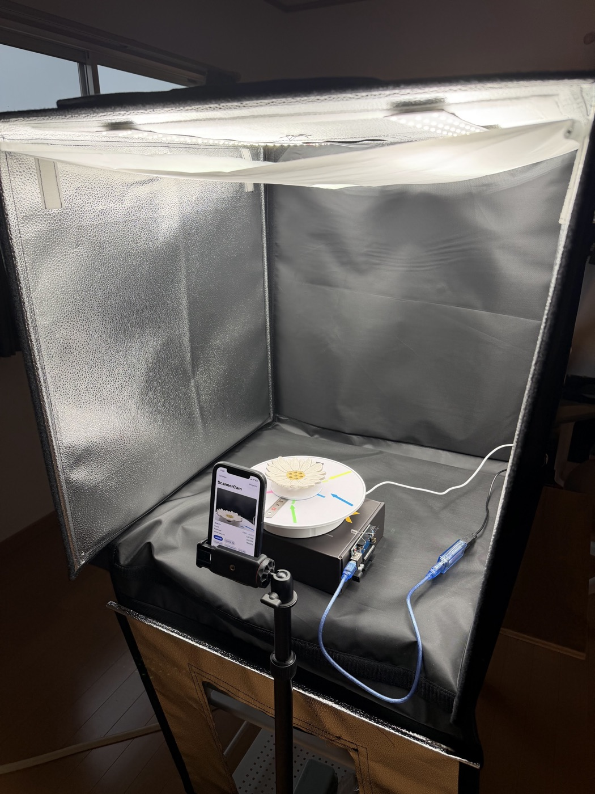

# ScannerCam — iPhone Camera Server

The phone's half of the rig. Turns an iPhone into a remotely triggered still camera
with a local HTTP API: the controller asks for a frame, the phone takes it, stores it,
and serves it back for download and verification.

**SwiftUI + AVFoundation + Network.framework. Zero third-party packages** — the
HTTP/1.1 server, router, request parser, response serializer, and bearer
authentication are all original. 2,824 lines across 35 files.

**→ [Browse this directory on GitHub](https://github.com/ariemeir/technical-portfolio/tree/main/3dscanner/capture/iphone)**
· [Full technical spec](../../docs/scannercam_spec.md)
· [API reference](../protocols/api_v1.md)

## Why a phone

A modern iPhone has better optics and a better sensor than most dedicated scanner
cameras, is already on the network, and needs no capture card. Critically for
photogrammetry, AVFoundation exposes hard **locks** on focus, exposure, and white
balance, and allows pinning to one physical lens — which is what makes 72 frames
shot over several minutes photometrically consistent enough to reconstruct.

<p align="center">
  
  <br>
  <em>ScannerCam in service, mounted facing the turntable. The three status rows on
  screen read <code>LOCKED</code> — focus, exposure, white balance. That state is not
  advisory: a capture request carrying <code>require_locks: true</code> is rejected with
  <code>409 camera_not_locked</code> unless all three are engaged, so the controller can
  refuse to record an inconsistent scan rather than discover it an hour later at
  reconstruction time. The locks reset when the app is backgrounded, so they are
  re-armed at the start of every session.</em>
</p>

## Layout

| Path | Lines | Contents |
|---|---:|---|
| `ScannerCam/Server/` + `Routes/` | 1,086 | HTTP/1.1 server, router, auth, 13 route handlers |
| `ScannerCam/Camera/` | 531 | `AVCaptureSession` management, lock controls, capture delegate, preview |
| `ScannerCam/UI/` | 392 | SwiftUI screens |
| `ScannerCam/Storage/` | 320 | Project/image/manifest persistence, atomic writes |
| `ScannerCam/Models/` | 190 | API request/response and storage types |
| `ScannerCam/Utilities/` | 134 | SHA-256, atomic file writer, ISO-8601, network info |
| `ScannerCam/Security/` | 90 | Keychain-backed API token |
| `ScannerCam/App/` | 81 | App entry point and lifecycle state |

## Building

The `.xcodeproj` is **generated**. `project.yml` is the source of truth — edit that,
then regenerate rather than hand-editing the project file:

```bash
cd capture/iphone/ScannerCam
xcodegen generate
xcodebuild -project ScannerCam.xcodeproj -scheme ScannerCam \
           -destination "id=<DEVICE_UDID>" -configuration Debug build
```

Requires iOS 17+ and a signing team — `project.yml` ships with a `YOUR_TEAM_ID`
placeholder. On a fresh device, both `-allowProvisioningUpdates` and
`-allowProvisioningDeviceRegistration` are needed for `xcodebuild` to auto-register
it; the first alone fails with "device isn't registered".

The app is dev-signed, so it does **not** transfer via iCloud or phone migration —
moving to a new phone means rebuilding from source and side-loading.

## Notable implementation details

**Per-connection dispatch queues.** Each accepted connection gets its own serial
queue. An earlier version shared one queue between the listener, all connection I/O,
and route handling — so a single blocking handler starved the listener and wedged
the entire server, including `/health`. See the
[engineering log](../../docs/engineering-log.md).

**A capture blocks its own request thread**, bridging AVFoundation's async completion
into the synchronous handler via a bounded semaphore. Intentional: only one capture
can run at a time regardless.

**Camera locking is enforceable from the API.** `require_locks: true` on a capture
request returns `409 camera_not_locked` unless focus, exposure, and white balance are
all engaged — so the controller can refuse to record an inconsistent scan rather than
discovering it at reconstruction time.

**One lens, pinned.** `builtInWideAngleCamera` only — never a virtual/dual device,
which would let iOS switch lenses mid-project and silently change the intrinsics.

**Atomic writes throughout.** Images land under a `.pending_` prefix and are renamed
into place; a startup sweep removes any leftovers. The manifest's `image_count` is a
*computed* property with hand-written coding, so it can never be decoded into a stale
stored value, and images are sorted by frame at the serialization boundary.

**Constant-time token comparison**, with a comment asking the next reader not to
replace it with `==`.

## State of the code

- **No automated tests.** Verified by manual `curl` sequences against the physical
  device, with downloads SHA-256-checked byte-for-byte on the controller side.
- **Bonjour is declared but never advertised.** The service type is in `Info.plist`,
  the spec requires it, and `/status` reports a Bonjour name — but nothing sets
  `NWListener.service`. Likely the real reason `.local` resolution never worked.
- **`project_id` is unvalidated on the `/projects/*` routes** (it *is* validated on
  the capture route), so an authenticated request can address a single-segment `..`
  and reach the data root.
- **Two screens are stubs** — Projects and Project Detail. Everything they would show
  works over the API; it is just not browsable on-device.
- **No diagnostic log.** `Logger.swift` declares categories; only four call sites use
  them, and the spec's rolling on-disk log and `/logs/recent` endpoint do not exist.
- **No app-lifecycle handling** — no `scenePhase` observer, so the spec's
  ready→degraded transition on backgrounding is not implemented.
- **Swift language mode 5**, deliberately — see the engineering log.
