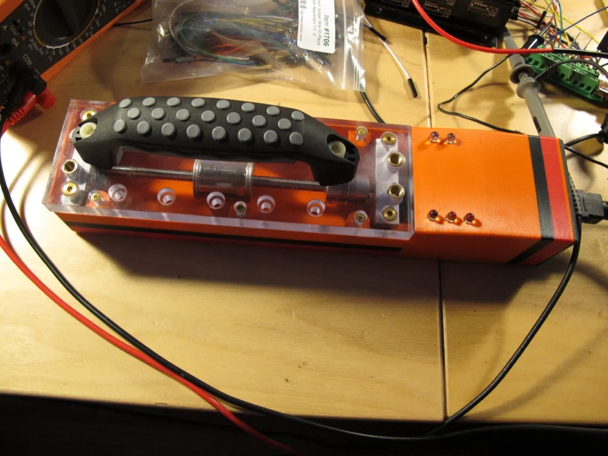
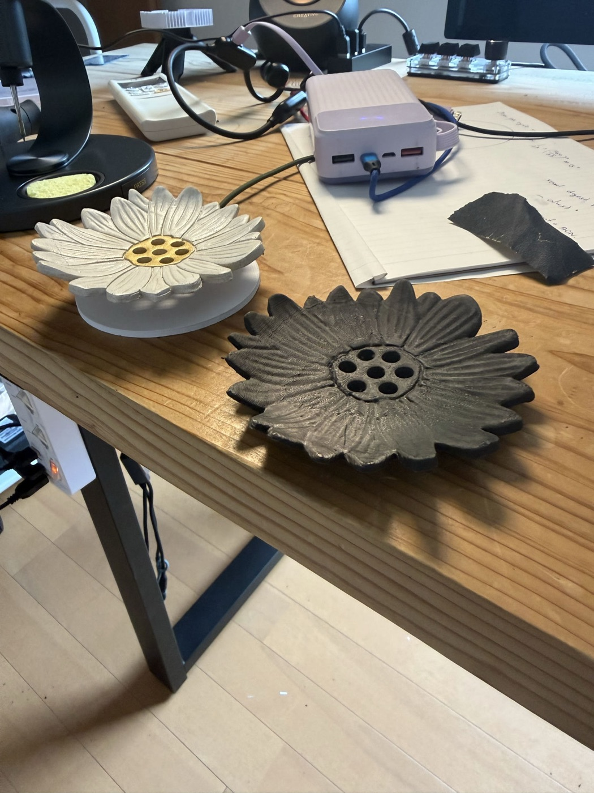

# Technical Portfolio — Arie Meir

Representative projects, published for reference.

**→ [Browse all source on GitHub](https://github.com/ariemeir/technical-portfolio)**

## Projects

### [RoboImplant](roboimplant/) — non-invasive spinal implant adjustment system

A motorized orthopedic implant that lengthens a spinal distraction rod without
surgery, for treating early-onset scoliosis in growing children. Full-stack
across four disciplines:

- **Embedded** — AVR C firmware on an ATmega1284P: real-time motor control via a
  DS1267 digital pot into a maxon ESCON servo controller, interrupt-driven
  rotation counting, and current-threshold coupling detection as the primary
  safety interlock.
- **Mobile** — Android clinician console over Bluetooth SPP, with a custom
  line-oriented ASCII protocol, live telemetry, 3D visualization, and patient
  records.
- **Electronics** — EAGLE schematic and board layout for the controller,
  including the analog current/voltage sensing chain.
- **Mechanical** — SolidWorks enclosure for the handheld driver unit.

<p align="center">
  
  <br>
  <em>The handheld driver unit (v1)</em>
</p>

**→ [Read the one-page case study (PDF)](roboimplant/docs/roboimplant-case-study-arie-meir.pdf)**

Research prototype, ~2012–2013. Not a cleared medical device.
See [`roboimplant/NOTICE.md`](roboimplant/NOTICE.md) for rights and third-party
attribution.

---

### [3D Scanner](3dscanner/) — turntable photogrammetry rig

A DIY tabletop 3D scanner that takes a physical object and produces a printable,
watertight STL. Five subsystems bound together by explicit contracts:

- **iOS** — **ScannerCam**, an iPhone camera server with a hand-rolled HTTP/1.1
  stack on `NWListener`: 13 REST routes, bearer auth with constant-time comparison,
  Keychain token storage, and hard locks on focus, exposure, and white balance.
  SwiftUI + AVFoundation, zero third-party packages.
- **Orchestration** — a Python session controller driving the scan loop across two
  machines, with idempotent retries, resumable sessions, and a five-stage SHA-256
  integrity chain from the phone's memory to the final archive.
- **Embedded** — an Arduino that controls the turntable by *impersonating its
  infrared remote*, replaying NEC codes reverse-engineered with a majority-vote
  capture sketch. No data port, no feedback, no encoder.
- **Reconstruction** — a Swift CLI over Apple Object Capture (RealityKit), chosen
  after COLMAP was tested and rejected for being CUDA-only on Apple Silicon.
- **Print prep** — a PyMeshLab pass that makes the mesh watertight, orients it by
  PCA, and scales it to real millimetres for printing and silicone-mold casting.

<p align="center">
  
  <br>
  <em>Input and output: the original ceramic dish, and a printed reproduction
  scanned from it.</em>
</p>

```
object ─→ 72 photos ─→ pose solve ─→ textured mesh ─→ watertight STL ─→ printed master
          locked        Object          USDZ/OBJ        PyMeshLab         silicone mold
          optics        Capture                         repair            → cast copies
```

The engineering centrepiece is control of an actuator that cannot be observed: the
turntable answers only to a fire-and-forget infrared *toggle*, so the controller
tracks an explicit assumed state and halts for human realignment on any ambiguity
rather than guessing and silently desynchronising the scan.

**→ [Read the engineering log](3dscanner/docs/engineering-log.md)**
· [Technical spec](3dscanner/docs/scannercam_spec.md)

Personal project, 2026. Working single-operator rig at late-prototype maturity.
See [`3dscanner/NOTICE.md`](3dscanner/NOTICE.md) for rights and attribution.

---

Each project directory carries its own README and rights notice. Unless stated
otherwise in a project's `NOTICE.md`, this work is published for reference only
and is not offered under an open-source license.
