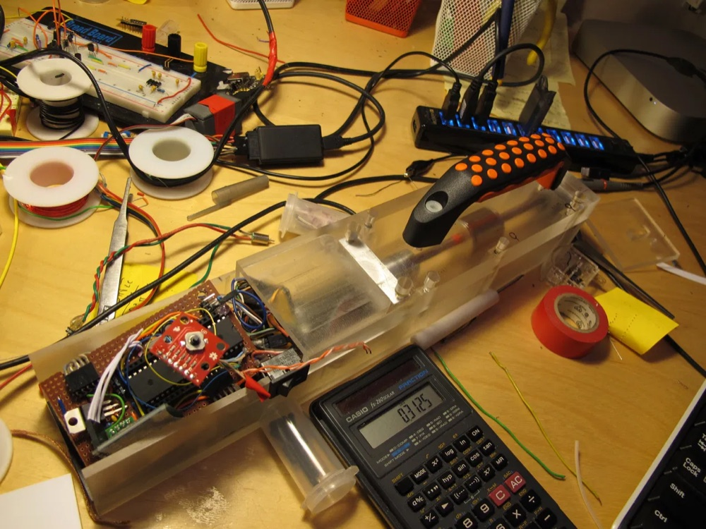
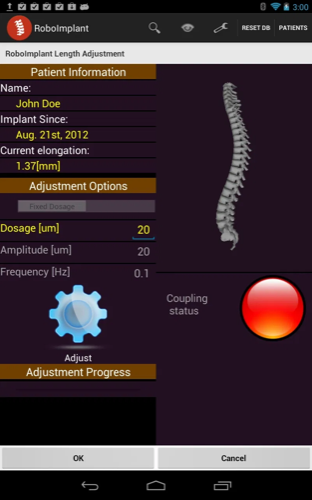
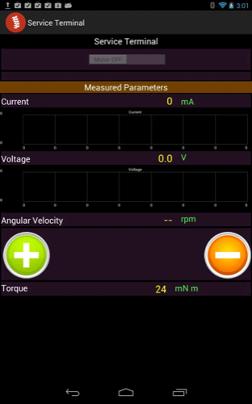
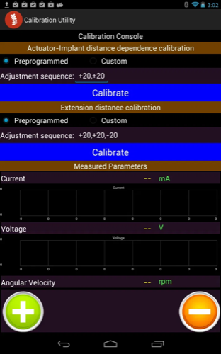
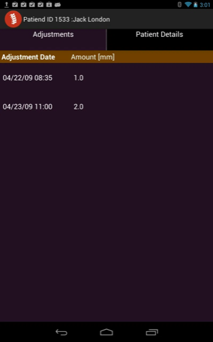

# RoboImplant — Non-Invasive Adjustment System for a Spinal Distraction Implant

An orthopedic medical-device prototype: a motorized implant that lengthens a
spinal distraction rod without surgery, driven by an AVR controller and commanded
from an Android tablet over Bluetooth.

<p align="center">
  
  <br>
  <em><strong>v1</strong> — 3D-printed housing, acrylic top plate, brass inserts and
  drive coil. The clinician holds this against the patient over the implant site;
  the drive coil couples magnetically through tissue to the implant's internal
  mechanism.</em>
</p>

Built ~2012–2013. Author: Arie Meir. Institutional work — see [NOTICE.md](NOTICE.md).

**→ [Read the one-page case study (PDF)](docs/roboimplant-case-study-arie-meir.pdf)**
· [Browse the source on GitHub](https://github.com/ariemeir/technical-portfolio/tree/main/roboimplant)

> **Reference only.** Not a cleared or approved medical device. Not for clinical
> use. All sample patient data in this repository is fictitious.

---

## The problem

Early-onset scoliosis is treated with growing rods implanted along the spine.
As the child grows, the rods must be lengthened — historically through a repeat
surgery every six months or so, each one carrying anesthetic and infection risk
and accumulating scar tissue.

This system lengthens the rod **without opening the patient**. An external driver
unit is placed against the skin over the implant, couples to it, and rotates an
internal lead screw. A clinician runs the procedure from a tablet, watching live
telemetry, and stops the moment anything looks wrong.

## How it works

```
┌─────────────────┐   Bluetooth SPP    ┌──────────────────┐   analog set-value  ┌─────────────┐
│  Android tablet │◄──────────────────►│   ATmega1284P    │────────────────────►│ maxon ESCON │
│   (clinician)   │  ASCII "at…"/"bt…" │   controller     │   via DS1267 pot    │  36/2 DC    │
└─────────────────┘                    └──────────────────┘                     └──────┬──────┘
                                          ▲   ▲                                        │
                              current /   │   │  rotation count                        ▼
                              voltage ADC │   │  (INT2, rising edge)              DC motor
                                          │   └────────────────────────────────────────┤
                                          └────────────────────────────────────────────┘
                                                                                   ┌────▼────┐
                                                                                   │ implant │
                                                                                   │   rod   │
                                                                                   └─────────┘
```

The clinician enters a **dose** — the console works in micrometres, typically
**20 µm per increment**, with cumulative elongation displayed in millimetres. The
controller converts the dose to a target number of motor rotations, spins the
motor, counts rotations via an interrupt, and stops when the target is reached.

Available drive torque falls off as the distance between actuator and implant
grows, which is why the system carries dedicated calibration routines for both
coupling and extension behaviour.

**Coupling detection is the safety-critical part.** The driver is only actually
turning the implant when it is mechanically engaged with it. Engagement shows up
as a step change in motor current — an uncoupled motor spins nearly free. The
firmware thresholds motor current at `COUPLING_THRESHOLD_CURRENT` (35 mA) to
decide whether it is coupled, and reports every transition to the tablet
immediately rather than waiting for the next periodic update. If coupling is
lost mid-procedure, rotation counting stops, so a rod that isn't turning is never
credited with lengthening it didn't do.

<p align="center">
  
  <br>
  <em><strong>v2</strong> — machined polycarbonate body with the controller
  electronics integrated alongside the coil assembly, shown open on the bench.</em>
</p>

## The clinician console

The Android app is what the clinician actually operates. Four screens carry the
whole workflow:

| | |
|:--:|:--:|
|  |  |
| **Procedure screen.** Dosage entry, current elongation, and the coupling indicator — red until motor current crosses 35 mA, which is how the system knows the driver is genuinely engaged with the implant rather than spinning free. | **Service terminal.** The engineering view: current, voltage, angular velocity, and torque derived from the motor constants, plotted live from the `bt*` telemetry stream. |
|  |  |
| **Calibration.** Runs preprogrammed adjustment sequences to characterise actuator-to-implant distance dependence and extension distance, capturing the no-load and loaded currents that set the coupling threshold. | **Adjustment history.** Per-patient log of every adjustment, with date and lengthening in millimetres. All sample data shown is fictitious. |

The 3D spine in the first screenshot was rendered with min3d from the mesh that
has since been removed for provenance reasons — see [NOTICE.md](NOTICE.md).

## Repository layout

| Path | Contents |
|---|---|
| [`firmware/`](firmware/) | AVR C firmware for the ATmega1284P controller |
| [`android/`](android/) | Eclipse ADT project — the clinician console app |
| [`hardware/`](hardware/) | EAGLE 6.1 schematic and board layout (`pcb/`), plus SolidWorks parts and assembly for the handheld driver (`enclosure/`) |
| [`models/`](models/) | 3D rod models used by the app's visualization |
| [`docs/motor/`](docs/motor/) | maxon ESCON 36/2 servo-controller reference (vendor docs) |

## Serial protocol

Plain ASCII over Bluetooth SPP, line-oriented. Symmetric halves live in
`firmware/messageDispatcher.c` and
`android/src/edu/ucsf/roboimplantconsole/MessageDispatcher.java`.

**Tablet → controller** — `at`-prefixed, terminated `\n\r`:

| Command | Effect |
|---|---|
| `atmotoron` / `atmotoroff` | Enable / disable the motor |
| `atspeed <n>` | Set speed (0–255, digital-pot step) |
| `atcw` / `atccw` | Set rotation direction |
| `atdosage <n>` | Set target lengthening |
| `atstart` / `atstop` | Begin / end a procedure |
| `atreset` | Reset counters and statistics |
| `atupdate <0\|1>` | Toggle periodic telemetry |
| `atupdateinterval <ms>` | Set telemetry period (default 2500 ms) |
| `ati` / `atr` / `atu` / `atblink` | Info, read, unit, and LED-blink diagnostics |

Replies are `OK` or `ERROR`.

**Controller → tablet** — `bt`-prefixed telemetry:

`btcurrent` · `btcurrentamplitude` · `btvoltage` · `btvoltageamplitude` ·
`btangularspeed` · `btmseccounter` · `btremaining` · `btterminated` ·
`btlostcoupling` · `btestablishedcoupling`

The AVR has no floating-point unit worth using over a serial link, so numeric
values are transmitted as integers alongside their scaling factor — each numeric
opcode carries `<scaledValue> <scalingFactor>`, with the factor fixed at 1000
(`SCALING_FACTOR` in `firmware/config.h`). The Android side divides on receipt.

## State of the code

This is an archival snapshot of a research prototype, published as-is. Being
straight about what that means:

- **The Android project does not build as shipped.** Its Eclipse `.classpath` and
  `.project` reference two dependencies by absolute path on the original
  developer's Linux machine (`/home/ariemeir/…`): the **min3d** 3D engine, linked
  as a source folder, and **achartengine-1.0.0.jar**. Neither is included here.
  See [`android/README.md`](android/README.md).
- **Several firmware modules are present but not compiled.** The `SRC` line in
  `firmware/Makefile` excludes the SD-card logging subsystem, the AD7715 external
  ADC, and `samples.c`. These are experimental paths kept for reference.
  `lcd.c` is 8051/Keil code that would not compile against AVR at all.
- **Hardware artifacts are in proprietary binary formats.** The schematic needs
  EAGLE 6.x; the enclosure needs SolidWorks. No neutral STEP/STL/PDF exports were
  made, so neither is viewable directly on GitHub.
- The Android manifest requests several permissions the app does not need
  (`ACCESS_SURFACE_FLINGER`, `ACCESS_FINE_LOCATION`, `READ_PHONE_STATE`, and
  `ACCESS_BACKGROUND_SERVICE`, which is not a real Android permission). Vestigial.
- `ConfigDB.java` hardcodes the Bluetooth MAC addresses of the original bench
  hardware.
- **The anatomical spine mesh has been removed** because its origin could not be
  verified, so the app's 3D spine view has no geometry to load. Rod geometry is
  original and retained. See [NOTICE.md](NOTICE.md).

## Key sources

Direct links into the code on GitHub:

| File | Why it's worth reading |
|---|---|
| [`firmware/config.h`](https://github.com/ariemeir/technical-portfolio/blob/main/roboimplant/firmware/config.h) | System model — every physical parameter, calibration value, and state struct in one place |
| [`firmware/main.c`](https://github.com/ariemeir/technical-portfolio/blob/main/roboimplant/firmware/main.c) | Timer/interrupt setup, procedure state machine, coupling logic |
| [`firmware/messageDispatcher.c`](https://github.com/ariemeir/technical-portfolio/blob/main/roboimplant/firmware/messageDispatcher.c) | Command parser, controller side |
| [`firmware/digitalPot.c`](https://github.com/ariemeir/technical-portfolio/blob/main/roboimplant/firmware/digitalPot.c) | DS1267 SPI driver — how motor speed is actually commanded |
| [`firmware/adc.c`](https://github.com/ariemeir/technical-portfolio/blob/main/roboimplant/firmware/adc.c) | Current/voltage sensing — the input to coupling detection |
| [`AdjustmentActivity.java`](https://github.com/ariemeir/technical-portfolio/blob/main/roboimplant/android/src/edu/ucsf/roboimplantconsole/AdjustmentActivity.java) | The procedure screen the clinician drives |
| [`MessageDispatcher.java`](https://github.com/ariemeir/technical-portfolio/blob/main/roboimplant/android/src/edu/ucsf/roboimplantconsole/MessageDispatcher.java) | Telemetry parser and listener fan-out |
| [`BluetoothSerialService.java`](https://github.com/ariemeir/technical-portfolio/blob/main/roboimplant/android/src/edu/ucsf/roboimplantconsole/bluetooth/BluetoothSerialService.java) | Bluetooth SPP connection state machine |
