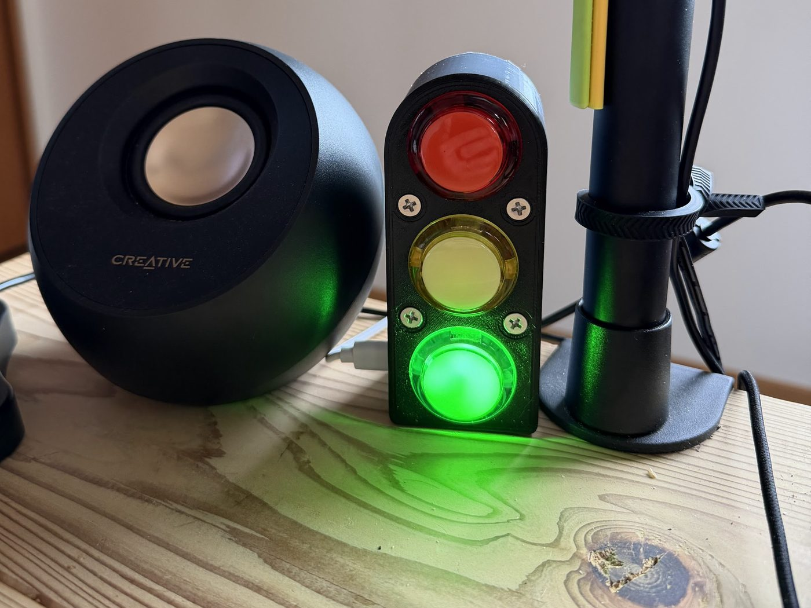
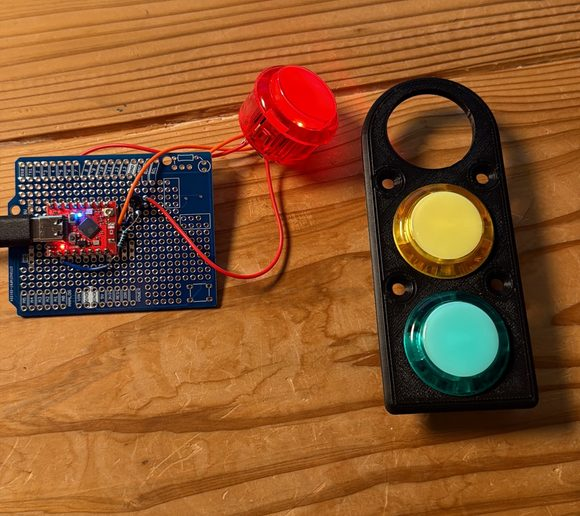
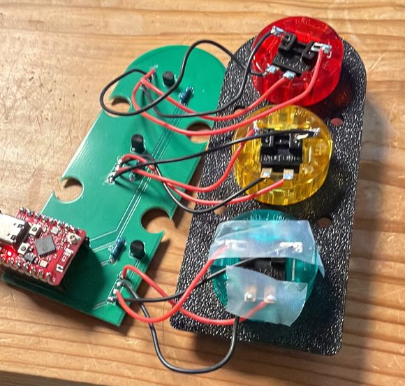

# WifeSignal — A Traffic Light for the Office Door

A three-colour desk lamp that lets one person in the house tell another *how much
this can wait*, without a phone, a notification, or an interruption. An iPhone app
sends a priority; a Mac in the office translates it to Bluetooth Low Energy; a
custom PCB lights one of three illuminated arcade buttons. Pressing that button
acknowledges the message, and the sender's phone shows **Seen ♥**.

<p align="center">
  
  <br>
  <em>The whole point of the project in one frame: green — <strong>whenever you're
  free</strong>. The speaker beside it is the reason the system exists. With music
  on and the windows closed, the office is acoustically sealed off from the house,
  and the phone is face-down and ignored on purpose. The light is the one channel
  that gets through without breaking concentration.</em>
</p>

Built 2026. Author: Arie Meir. Personal project — see [NOTICE.md](NOTICE.md).

**→ [Browse the source on GitHub](https://github.com/ariemeir/technical-portfolio/tree/main/wifesignal)**
· [Server](server/) · [iOS app](app/) · [Firmware](firmware/) · [Hardware](device/)

> **Reference only.** A working system in daily use, published so the engineering
> can be read. Deployment specifics (signing team, App Store Connect key IDs,
> Tailscale hostname, absolute paths) have been replaced with placeholders. No
> credential or token appears anywhere in this directory.

---

## The problem

The office is a separate building, a short walk from the house. Work there happens
with music on and the windows closed, which is exactly the point — and which makes
it a sealed box. The phone is face-down and unchecked for hours at a time, by
design.

That produces a genuinely asymmetric problem for the household. A message that
means *call your mother back sometime this week* and a message that means *the
delivery driver is leaving in thirty seconds* arrive through the same silent
channel and get read at the same time, which is to say eventually. The available
options were both bad: text and hope, which fails when it matters, or walk over,
which always works and always costs an interruption regardless of whether the
thing was urgent.

The missing piece was never notification. It was **priority, expressed before the
interruption happens**. The system had to satisfy four constraints:

- **Glanceable, not readable.** The signal must land in peripheral vision without
  pulling attention into a screen. Deciding whether to break focus should not
  itself break focus.
- **Three levels, not a text box.** Composing a message is work for the sender and
  ambiguity for the receiver. Three buttons removes both.
- **Acknowledgement must flow back.** A signal that vanishes into silence is worse
  than no signal — the sender is left wondering whether to walk over anyway. The
  loop only closes when she can see that it landed.
- **It cannot depend on the phone being looked at.** Which rules out every
  push-notification solution, since that is the failure mode being designed around.

The result is a shared vocabulary of three words — **Whenever**, **Soon**, **Now**
— with a physical object in the room that speaks it.

<p align="center">
  
  <br>
  <em>The sender's whole interface. The palette is deliberately soft — the urgent
  case is a <em>rose</em>, not a fire-alarm red, and its icon is
  <code>bolt.heart.fill</code>. This is a channel between two people who like each
  other, not an alerting console. The status row is the acknowledgement path:
  <strong>Waiting…</strong> until the button is physically pressed, then
  <strong>Seen ♥</strong>.</em>
</p>

## How it works

Five components, four protocol boundaries, and one byte that carries the entire
system state.

```
┌─────────────┐   HTTPS + Bearer    ┌──────────────────┐    BLE GATT    ┌──────────────┐
│  iPhone app │ ──────────────────► │  aiohttp server  │ ─────────────► │  ESP32-C3    │
│  (SwiftUI)  │   tailnet only      │  (Mac, launchd)  │   1 byte       │  + 3 lamps   │
│             │ ◄────────────────── │                  │ ◄───────────── │              │
└─────────────┘   GET /v1/status    └──────────────────┘   NOTIFY       └──────────────┘
                  every 5 s                                             physical press
                                                                        = acknowledge
```

The architectural keystone is the middle box, and it exists for one reason: **an
iPhone cannot be a reliable BLE central for a device in another building.** iOS
suspends background Bluetooth work aggressively, and the phone is frequently not
in the office at all. So the phone never speaks Bluetooth. A Mac that is already
sitting three metres from the lamp, already powered, already on the network, takes
that role permanently. Everything else in the stack — the Tailscale tunnel, the
launchd job, the macOS Bluetooth permission grants — is the price of that single
decision, and it is worth paying: the phone's job shrinks to an authenticated HTTP
POST, which is a thing phones do perfectly.

Transport is [Tailscale](https://tailscale.com) `serve`, not a public tunnel. The
API is reachable only from devices on the tailnet, over a real Let's Encrypt
certificate, with the second phone joined by **node sharing** so it resolves the
one host and sees nothing else on the network. The bearer token is the inner
layer; the tailnet ACL is the wall.

## One byte on the wire

The BLE contract is a single characteristic carrying a single byte:

| Value | Meaning |
|---|---|
| `0x00` | all lamps off |
| `0x01` | red — *Now* |
| `0x02` | yellow — *Soon* |
| `0x03` | green — *Whenever* |

Three channels addressed **by value, not by bitmask**. That choice is doing real
work. The product rule is *exactly one signal is active at a time*, and encoding
the channels as a bitmask would have made "red and green simultaneously" a
representable state — one that every layer would then need to defend against. As
an enumeration, the illegal state cannot be expressed on the wire at all. There is
no validation code for it anywhere in the server or the firmware, because there is
nothing to validate.

The same byte is read, written, and notified, which is what makes the
acknowledgement path collapse into almost nothing: the device does not need a
separate "ack" message, because setting the state to `0` *is* the acknowledgement.

## Telling your own echo from a human being

This is the interesting problem in the system, and it comes directly from that
economy. Because the state byte is bidirectional, the server has to distinguish
three events that arrive through the identical mechanism — a `NOTIFY` carrying one
byte:

1. **Its own write, echoed back.** The firmware notifies subscribers whenever the
   characteristic changes, including when the change came from the server itself.
2. **A physical button press**, which is the acknowledgement and the entire reason
   the return path exists.
3. **Drift** — the device holding a state that disagrees with the server, after a
   reboot, a reflash, or a button press while idle.

The conventional fixes are correlation IDs, sequence numbers, or a suppression
window timed around each write. All three add state, and the timer-based one is
subtly wrong under load. The server instead exploits the fact that it already
knows what the lamps *should* show, in a variable named `desired_state`, and
classifies every incoming notify by comparing against it:

| Notify value | vs. `desired_state` | Interpretation | Action |
|---|---|---|---|
| equal | — | echo of our own write | ignore |
| `0` | non-zero | **physical press** | mark acknowledged, timestamp it |
| anything else | mismatch | drift | re-assert `desired_state` |

Three branches, no timers, no message IDs, no sequence numbers. The third branch is
load-bearing in a way that is easy to miss: it is simultaneously the anti-drift
mechanism *and* the hook for a future "ping back" feature, where a press from idle
would signal in the other direction. Today the server writes that press straight
back to off, which is the correct conservative behaviour for a feature whose
semantics have not been decided.

## Converging instead of queueing

`desired_state` is defined as a pure function of the signal: *the colour byte iff a
signal is active and un-acknowledged, else zero.* HTTP handlers never touch
Bluetooth. They mutate state under an `asyncio.Lock` and set an
`asyncio.Event`; a single BLE task owns the `BleakClient` and performs every write.

There is **no queue and no retry list**, which is the point. A burst of taps
coalesces into one write of the latest value, because last-write-wins is exactly
right for a lamp — nobody wants a backlog of stale colours replayed at them. More
importantly, the same property makes recovery free. The reconnect loop re-writes
`desired_state` immediately on every successful connect, so a device that rebooted,
lost power, or was reflashed mid-signal comes back showing the correct colour
without anyone noticing, and without a single line of reconciliation logic.

Convergence, not delivery. The server never asks *did that message arrive?* — it
continuously asserts *this is what the lamps should show*, and any disagreement
resolves itself on the next connect. Around it sits an ordinary supervisor:
scan by service UUID, connect, subscribe, race the write-needed and disconnected
events, and back off exponentially from 1 s to a 30 s ceiling on failure.

## The soldered parts win

The lamp drivers on the assembled board are **S8550 PNP** transistors. The
schematic says **S8050 NPN**. They came from the same assortment kit, the part
numbers differ by one character, and the mistake was found only after the board was
populated and the lamps behaved backwards.

A PNP low-side driver inverts the control logic: **GPIO LOW turns the lamp on.**
The fix was one line in `applyLamps()` and a comment in capital letters telling the
next engineer not to "correct" it back. Reworking three transistors on a working
board would have bought nothing except the satisfaction of matching a drawing.

The second-order consequence was subtler and took longer to find. A pin that has
not yet been configured as an output floats, and a floating base on a PNP driver
reads as *on* — so all three lamps flashed at every boot. The fix is an ordering
trick that is worth knowing: **drive the pin high, then call `pinMode(OUTPUT)`,
then drive it high again.** The first write latches the level into the output
register before the driver is enabled, so the pin never passes through an undefined
state on its way to being an output.

The schematic in this repository is therefore **knowingly wrong**, and documented
as such. That is the honest artifact of a physical project: the drawing describes
an intention, the board describes reality, and the firmware is written against
reality.

## Failures that make no sound

Every hard bug in this project failed silently. None threw an exception; all of
them just quietly did nothing, which is the worst possible behaviour and the reason
the codebase is structured around detecting symptoms rather than catching errors.

**macOS returns empty Bluetooth scans when permission is missing.** Not an error,
not a prompt — an empty list, indistinguishable from "no devices nearby". The scan
function therefore counts how many advertisements it saw *at all*, and when the
count is zero it logs a warning naming the actual cause and the exact System
Settings pane. The launchd-run interpreter needs its own grant, separate from the
one Terminal inherits, and the grant is attached to the Python binary's path — so a
Homebrew upgrade silently revokes it.

**macOS also hides advertised device names**, returning `None` for all of them, so
name-based matching finds nothing forever. All matching in this project is by
service UUID, in three separate files, each with a comment explaining why.

**A `snake_case` JSON key would have silently decoded to `nil`** in Swift rather
than throwing. The server's responses are deliberately camelCase (`sentAt`,
`acknowledgedAt`) with a comment on both sides of the boundary recording that the
iOS app decodes with a bare `JSONDecoder` and would drop the timestamps without
complaint.

**A folder move broke the LaunchAgent without a single log line.** Absolute paths
in the plist and in the ops script pointed at the old location; launchd simply
declined to start the job. In the published copy those paths are placeholders
(`__PROJECT_DIR__`, `__HOME__`) and the ops script derives its own location, which
is what should have been true from the start.

**The device accepts exactly one BLE central.** The test CLI and the server cannot
both be connected, and the failure looks like an unrelated timeout. Documented at
the top of every file that connects.

## From breadboard to fabricated board

Four stages, roughly two weeks, each one earning the next.

| | |
|:--:|:--:|
|  |  |
| **1. One channel on protoboard.** A single button and lamp, proving the BLE service, the button semantics and the inverted lamp polarity before committing to a layout. The faceplate beside it is already the target shape. | **2. Rev A, fabricated.** Three identical channels: GPIO → 1 kΩ → transistor base, emitter to ground, collector to lamp cathode. Entirely through-hole, two layers, no vias. The four edge notches are not decoration — see below. |
|  |  |
| **3. Assembled.** The ESP32-C3 sits on female headers, so it is removable and the board is not scrap if the module dies. Each button is a four-wire part: lamp anode and cathode, switch common and normally-open. | **4. In the enclosure.** The board drops over four M4 pillars — the notches at (±16, ±18.5) mm are cut to clear them exactly. The electrical and mechanical designs are dimensionally coupled, and both say so in comments. |

The pin assignment carries one hard-won rule: **GPIO 2, 8 and 9 are strapping pins
and 20/21 are UART0** on the ESP32-C3, so all five are avoided. Strapping pins are
sampled at boot to decide boot mode; hanging a lamp driver off one produces a board
that works perfectly until the day it refuses to start.

| | Red | Yellow | Green |
|---|---|---|---|
| **switch** | GPIO3 | GPIO4 | GPIO5 |
| **lamp** | GPIO6 | GPIO7 | GPIO10 |

Buttons are `INPUT_PULLUP` with common tied to ground, so a press reads LOW,
debounced at 40 ms with a per-button handled flag.

## An enclosure that is a program

The enclosure is not an STL and not a saved CAD file. It is a **440-line Python
script that generates the entire two-part enclosure inside Autodesk Fusion 360**,
and it is the declared source of truth — the design is rebuilt from code, not
edited by hand.

That is not novelty for its own sake. It buys the same things version-controlled
code always buys, in a domain where they are usually unavailable:

- **Dimensions are derived, not typed.** The body width is
  `BUTTON_HOLE_DIA + 2 × SIDE_MARGIN`; the height is `BUTTON_SPACING × 2 + 2 ×
  END_MARGIN`. Changing the button diameter reshapes the whole enclosure
  consistently, instead of leaving four stale numbers behind.
- **Physical measurements are named constants.** The USB-C window's vertical extent
  is computed from the measured height of the connector above the PCB and the
  thickness of the spacer stack, not eyeballed against a screen.
- **The build is versioned in-band.** `VERSION = "v15"` with a build stamp, printed
  to a dialog on completion, so the running copy can be identified — the script
  lives in two places and drift is otherwise invisible.
- **Fragile operations are individually guarded.** Fillets and countersinks are the
  features most likely to fail on a given geometry, so each is wrapped and reports
  `built | FAILED | skipped` rather than aborting the run and losing everything.

The visible result of iterating in code is a redesign that would have been painful
by hand: v12 held the bare dev board on edge in a printed cradle; v15 deletes the
cradle entirely, deepens the tray from 30 mm to 37 mm, and bolts the custom PCB
flat to four pillars — the change that turned a prototype holder into a product.

## Repository layout

| Path | Contents |
|---|---|
| [`server/`](server/) | The whole bridge: aiohttp HTTP API + bleak BLE central, 290 lines, one file, one event loop. Plus a standalone BLE test CLI. |
| [`app/`](app/) | SwiftUI iPhone app, 333 lines across 7 files. XcodeGen spec; no `.xcodeproj` in the repo. |
| [`firmware/`](firmware/) | ESP32-C3 firmware (NimBLE-Arduino). The current 3-channel build, plus the 1-channel bring-up sketch kept as reference. |
| [`device/WifeSignalPCB/`](device/WifeSignalPCB/) | KiCad project and fabrication output. `WifeSignal3ch` is the board that was made. |
| [`device/enclosure/`](device/enclosure/) | The Fusion 360 generator script — the CAD source of truth. |
| [`ops/`](ops/) | launchd LaunchAgent template and the `up/down/restart/status/logs/ack` operator script. |

## The HTTP API

All JSON, all bearer-authenticated except `/health`, which ops tooling needs to
reach before it can know whether anything else works.

| Method | Path | Purpose |
|---|---|---|
| `POST` | `/v1/signal` | `{"color": "green"\|"yellow"\|"red"}` — set the signal, light the lamp |
| `POST` | `/v1/clear` | Wipe the signal, all lamps off |
| `POST` | `/v1/ack` | Acknowledge without clearing the colour — the CLI equivalent of a physical press |
| `GET` | `/v1/status` | Polled by the app every 5 s |
| `GET` | `/health` | Unauthenticated; reports `deviceConnected` |

Token comparison is constant-time via `hmac.compare_digest`, and the server refuses
to start with an empty token rather than defaulting to open. Device liveness is
surfaced to the app as a soft field rather than an error, so a disconnected lamp
degrades the UI instead of breaking it.

## The BLE contract

| | |
|---|---|
| Service UUID | `6d5f0001-4b6b-4a3a-9e1e-2a7b1c9f0001` |
| STATE characteristic | `6d5f0002-4b6b-4a3a-9e1e-2a7b1c9f0002` |
| Properties | `READ` \| `WRITE` \| `NOTIFY`, 1 byte |
| Advertising | Service UUID in the advertisement, 100–200 ms interval |
| Matching | **By service UUID only** — macOS reports advertised names as `None` |

Firmware button semantics, which must stay in lockstep with the server's
classification table: a press while `state != 0` sets `0` and notifies (that is the
acknowledgement); a press while `state == 0` sets that button's colour, which the
server writes back off.

## State of the code

A working system in daily use, honestly described. What that means:

- **The acknowledgement is not instant.** It arrives on the next 5 s poll. A
  WebSocket rewrite was considered and explicitly rejected — polling is
  imperceptible at this cadence and the HTTP stack was already deployed and proven.
- **The app only sees acknowledgements while foregrounded.** Polling is a plain
  `Task` loop that never pauses in the background, and there is no
  `BGTaskScheduler` and no push. For the sender's actual usage — open the app, tap,
  watch for *Seen* — this is fine, and it is still a real limitation.
- **Poll failures after the first success are swallowed.** The error is only
  surfaced when there is no status at all, so a server that dies mid-session leaves
  the last-known state on screen without a warning.
- **The API token lives in `UserDefaults`, not the Keychain.** Acceptable only
  because the API is tailnet-only and can do nothing but change a lamp colour; it
  should still be in the Keychain.
- **URL validation is `URL(string:) != nil`**, which accepts very nearly anything.
- **The schematic disagrees with the built board** on the transistor part number,
  deliberately and with the reason documented in three places.
- **The 1-channel PCB variant was never routed or fabricated.** It is kept as a
  design-history artifact; only `WifeSignal3ch` exists physically.
- **A "ping back" path is stubbed but not designed.** The hook is live in the
  notify handler; the semantics are undecided, so a press from idle is currently
  written straight back to off.

## Key sources

| File | Why it's worth reading |
|---|---|
| [`server/server.py`](https://github.com/ariemeir/technical-portfolio/blob/main/wifesignal/server/server.py) | The whole bridge in 290 lines. The `on_notify` classifier and the `ble_loop` supervisor are the heart of the system. |
| [`firmware/wifesignal_3ch/wifesignal_3ch.ino`](https://github.com/ariemeir/technical-portfolio/blob/main/wifesignal/firmware/wifesignal_3ch/wifesignal_3ch.ino) | The PNP polarity note and the latch-before-`pinMode` boot-flash fix, with the button semantics documented as a contract with the server. |
| [`app/WifeSignal/SignalViewModel.swift`](https://github.com/ariemeir/technical-portfolio/blob/main/wifesignal/app/WifeSignal/SignalViewModel.swift) | 38 lines: the poll loop and its deliberately forgiving — and knowingly flawed — error policy. |
| [`app/WifeSignal/ContentView.swift`](https://github.com/ariemeir/technical-portfolio/blob/main/wifesignal/app/WifeSignal/ContentView.swift) | The entire UI, including the *Waiting… → Seen ♥* status card. |
| [`device/enclosure/AWifeSignalEnclosure.py`](https://github.com/ariemeir/technical-portfolio/blob/main/wifesignal/device/enclosure/AWifeSignalEnclosure.py) | Parametric CAD as a program: derived dimensions, measured constants, guarded feature steps. |
| [`device/WifeSignalPCB/WifeSignal3ch.kicad_sch`](https://github.com/ariemeir/technical-portfolio/blob/main/wifesignal/device/WifeSignalPCB/WifeSignal3ch.kicad_sch) | The schematic, including the in-drawing notes mapping refs to channels — and the wrong transistor. |
| [`ops/wife-signal`](https://github.com/ariemeir/technical-portfolio/blob/main/wifesignal/ops/wife-signal) | launchd bootstrap, health polling, and Tailscale serve configuration in one operator script. |
| [`server/wifesignal_cli.py`](https://github.com/ariemeir/technical-portfolio/blob/main/wifesignal/server/wifesignal_cli.py) | 69-line BLE REPL for talking to the board directly when the server is stopped. |
