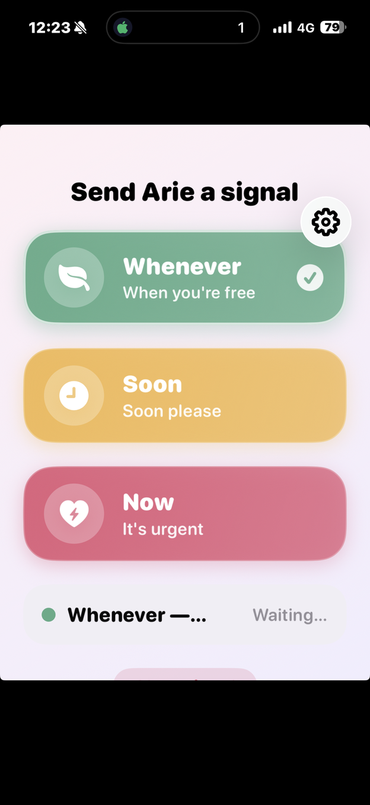

# iOS App — The Sender's Interface

A SwiftUI iPhone app: three buttons, a status line, and a settings sheet. 333 lines
across 7 files, no third-party packages, no BLE. The phone's entire job is an
authenticated HTTP POST.

**→ [Browse this directory on GitHub](https://github.com/ariemeir/technical-portfolio/tree/main/wifesignal/app)**

<p align="center">
  
  <br>
  <em>Three taps' worth of vocabulary. The active signal carries a tick and a
  brighter border; the status row below is the acknowledgement path.</em>
</p>

## The three levels

| Case | Title | Label | Colour | Symbol |
|---|---|---|---|---|
| `.green` | **Whenever** | "When you're free" | sage | `leaf.fill` |
| `.yellow` | **Soon** | "Soon please" | honey | `clock.fill` |
| `.red` | **Now** | "It's urgent" | rose | `bolt.heart.fill` |

The palette is a deliberate design decision rather than a default. The urgent case
is a **rose**, not `Color.red`, and its icon is `bolt.heart.fill` — urgency with
affection rather than alarm. This is a channel between two people who like each
other; making it look like a pager would have been a design error, not a neutral
choice.

## The acknowledgement path

The status card is the reason the whole return path exists. Once a signal is sent it
shows the colour and **Waiting…**; when the byte comes back as `0` from a physical
button press, the server marks it acknowledged and the next poll flips the card to
**Seen ♥**.

That closing of the loop is what makes the system usable. Without it the sender is
left wondering whether to walk over anyway, and the device has bought nothing.

## Polling

`startPolling()` is a plain `Task` loop: refresh, sleep 5 s, repeat, until
cancelled. Worst-case visible latency for an acknowledgement is therefore one poll
interval.

A WebSocket rewrite was proposed and **explicitly rejected**: 5 s is imperceptible
for this interaction, and the HTTP stack was already deployed, proven, and trivial
to reason about. The cost of the polling choice is real but small; the cost of a
persistent-connection rewrite would have been a new class of reconnect bugs on both
sides.

## Files

| File | Purpose |
|---|---|
| [`WifeSignal/WifeSignalApp.swift`](WifeSignal/WifeSignalApp.swift) | `@main`. Owns the view model; refreshes once then starts polling on `.task`. |
| [`WifeSignal/ContentView.swift`](WifeSignal/ContentView.swift) | The entire UI — signal buttons, status card, clear button, settings toolbar item. |
| [`WifeSignal/Models.swift`](WifeSignal/Models.swift) | `SignalColor` (title, label, colour, symbol) and the Codable status/request structs. |
| [`WifeSignal/SignalAPI.swift`](WifeSignal/SignalAPI.swift) | URLSession client, 15 s timeout, typed `SignalAPIError`. |
| [`WifeSignal/SignalViewModel.swift`](WifeSignal/SignalViewModel.swift) | `@MainActor ObservableObject` — the poll loop and error policy. |
| [`WifeSignal/SettingsView.swift`](WifeSignal/SettingsView.swift) | Server URL + token, entered once, surviving reinstalls. |
| [`WifeSignal/AppSettings.swift`](WifeSignal/AppSettings.swift) | `UserDefaults`-backed configuration. |
| [`project.yml`](project.yml) | XcodeGen spec. The `.xcodeproj` is generated, not committed. |

## Known limitations

Carried over from the project's own review and left honest:

- **Poll failures after the first success are swallowed.** The error is surfaced
  only when there is no status at all, so a server that dies mid-session leaves a
  stale card on screen with no warning.
- **Polling never pauses in the background,** and there is no `BGTaskScheduler` and
  no push. The app only observes acknowledgements while foregrounded. For the actual
  usage pattern — open, tap, watch for *Seen* — this is acceptable; it is still a
  limitation.
- **The token is in `UserDefaults`, not the Keychain.** Defensible only because the
  API is tailnet-only and can do nothing but change a lamp colour.
- **URL validation is `URL(string:) != nil`**, which accepts nearly anything.
- **Raw server error bodies are shown in the UI.**

## Building

The project is generated from `project.yml`, so `DEVELOPMENT_TEAM` appears in
exactly one place (here it is the placeholder `YOUR_TEAM_ID`):

```bash
xcodegen generate --spec project.yml
xcodebuild -project WifeSignal.xcodeproj -scheme WifeSignal \
  -destination 'generic/platform=iOS' -allowProvisioningUpdates build
```

`../build.sh` drives the TestFlight path: bump the build number, regenerate,
archive, export, upload. It reads its App Store Connect key ID and issuer ID from
the environment (`WIFESIGNAL_KEY_ID`, `WIFESIGNAL_ISSUER_ID`) and expects the
private key at `app/secrets/AuthKey_<KEY_ID>.p8`, which is git-ignored and has never
been committed.

One signing note worth recording: the App Store Connect API key needs the **Admin**
role, or App Manager *with* "Access to Cloud Managed Distribution Certificate". A
plain App Manager key fails with an unhelpful "Cloud signing permission error".
