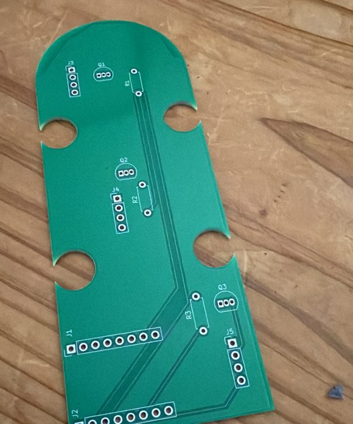
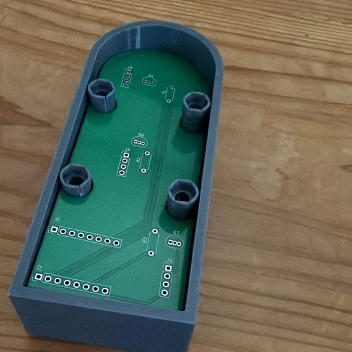

# Device — PCB and Enclosure

The physical object: a custom two-layer PCB carrying three lamp-driver channels, an
ESP32-C3 on removable headers, and three 30 mm illuminated arcade buttons in a
3D-printed two-part enclosure.

**→ [Browse this directory on GitHub](https://github.com/ariemeir/technical-portfolio/tree/main/wifesignal/device)**

| | |
|:--:|:--:|
|  |  |
| **Rev A, as fabricated.** Entirely through-hole, two layers, 62 track segments, no vias. The rounded end and the four edge notches are dictated by the enclosure. | **Mechanical fit.** The board drops over four M4 pillars. The notch centres at (±16, ±18.5) mm are cut to clear them exactly. |

## The circuit

Three identical channels, each a textbook low-side switch:

```
GPIO ──[1k]── base ; emitter ── GND ; collector ── lamp cathode
                                      lamp anode ── +5V
```

| Ref | Part | Notes |
|---|---|---|
| J1, J2 | 1×8 pin headers | ESP32-C3 SuperMini Plus, on **female** headers so the module is removable |
| J3, J4, J5 | 1×4 pin headers | One per button: `LED+`, `LED−`, switch `COM`, switch `NO` |
| Q1, Q2, Q3 | S8050 NPN *on the schematic* | **S8550 PNP as actually soldered** — see below |
| R1, R2, R3 | 1 kΩ | Base resistors |

Channel mapping carries through to the silkscreen: `R1/Q1/J3` = red, `R2/Q2/J4` =
yellow, `R3/Q3/J5` = green. Power arrives from the ESP32's USB connector, so three
`PWR_FLAG`s assert the +5 V and GND nets for the electrical rules check.

## ⚠️ The schematic is knowingly wrong

The board was populated with **S8550 PNP** transistors from an assortment kit; the
schematic specifies **S8050 NPN**. The part numbers differ by one character. This
was discovered only when the lamps behaved backwards.

A PNP low-side driver inverts the control sense — **GPIO LOW turns the lamp on** —
and the fix lives in the firmware rather than in a rework, because reworking three
transistors on an otherwise working board buys nothing but agreement with a drawing.
The schematic is left as-is and documented as wrong in three places, including a
shouted comment in the firmware header telling the next engineer not to "fix" it.

## Board geometry

41.0 × 88.5 mm. Flat at one end, a R20.5 semicircular arc at the other. Four
C-shaped notches (R4.7) centred at (±16, ±18.5) mm from the board centre.

The notches are the interesting part: the electrical and mechanical designs are
**dimensionally coupled**, and both say so in comments. The enclosure generator
places its four M4 pillars at exactly those coordinates, and the board is cut to
drop over them. Change one and the other stops fitting.

## Directories

| Path | Contents |
|---|---|
| [`WifeSignalPCB/`](WifeSignalPCB/) | KiCad project. `WifeSignal3ch.*` is the board that was fabricated; `WifeSignal.*` is an unrouted 1-channel variant kept as design history. `output/` holds the gerbers and drill files sent for fabrication. |
| [`enclosure/`](enclosure/) | The Fusion 360 script that generates the enclosure — the CAD source of truth. |

## Bill of materials

| Qty | Item |
|---|---|
| 1 | ESP32-C3 SuperMini Plus |
| 3 | 30 mm illuminated arcade buttons (red, yellow, green), 4-terminal |
| 3 | S8550 PNP transistors, TO-92 |
| 3 | 1 kΩ resistors, axial |
| 2 | 1×8 female pin headers |
| 3 | 1×4 pin headers |
| 4 | M4 × 10 bolts + nuts (press-fit into the printed pillars) |
| 1 | Custom PCB, 41.0 × 88.5 mm, two layers, through-hole |
